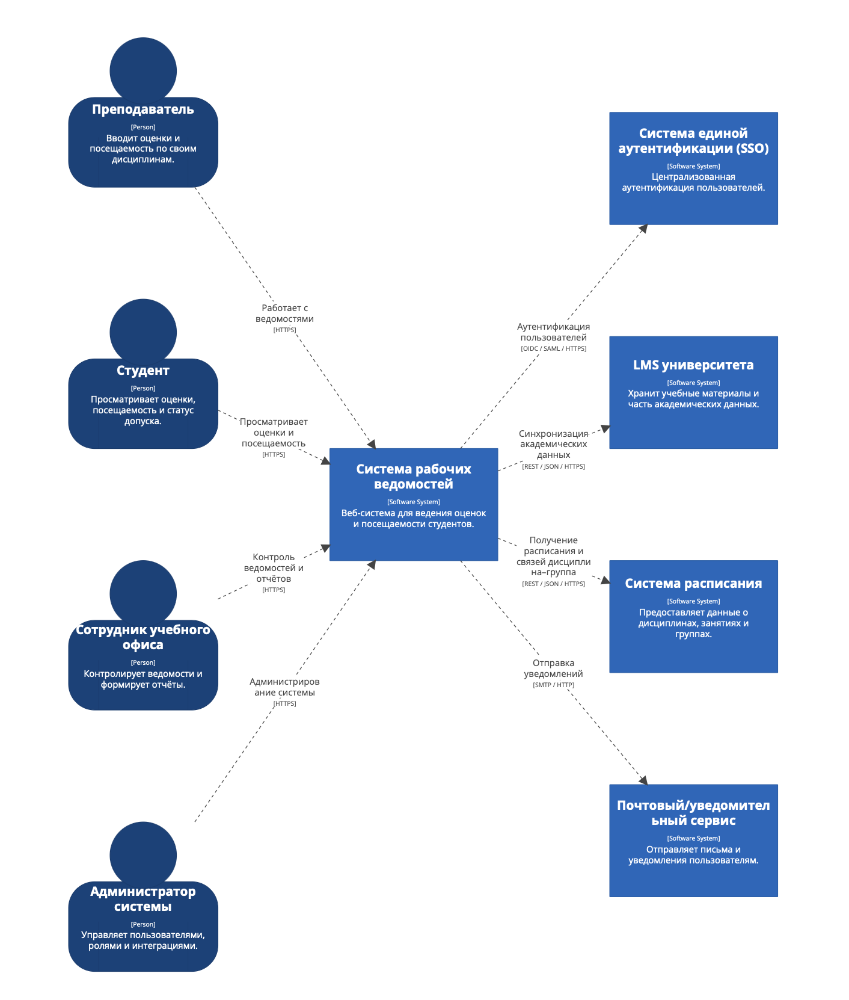
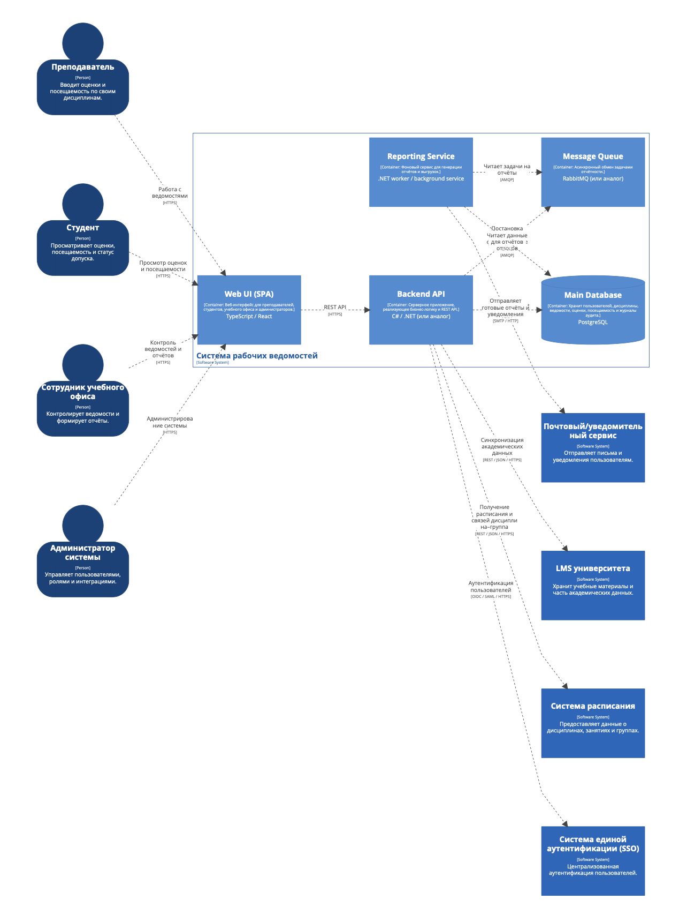
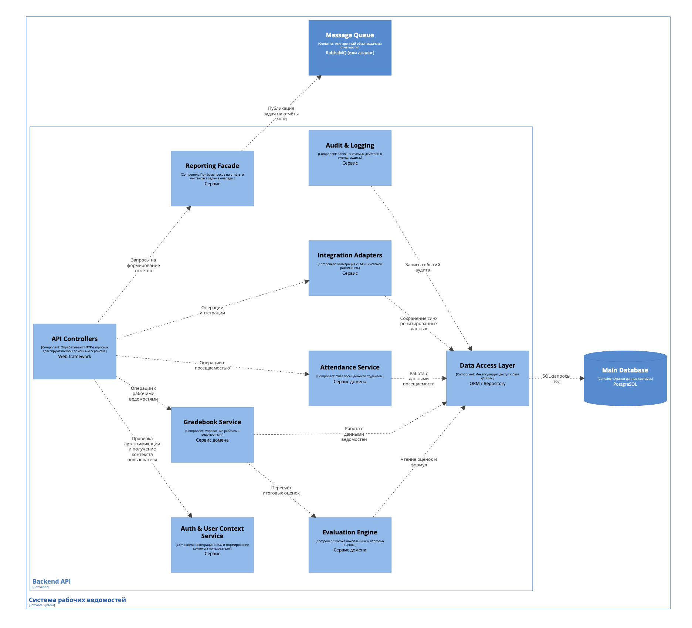

# Лабораторная работа №2
**Тема:** Использование нотации C4 model для проектирования архитектуры программной системы.

**Цель работы:** Получить опыт использования графической нотации для фиксации архитектурных решений.

## Диаграмма системного контекста

Диаграмма системного контекста показывает систему рабочих ведомостей в окружении пользователей и внешних информационных систем.

**Основные элементы диаграммы:**

- **Система в фокусе**
  - **Система рабочих ведомостей** — веб-система для ведения оценок и посещаемости студентов по дисциплинам, а также формирования отчётности для учебного офиса.

- **Пользователи (актёры):**
  - **Преподаватель** — вводит оценки по элементам контроля, отмечает посещаемость, настраивает формулу оценивания, закрывает рабочие ведомости.
  - **Студент** — просматривает свои текущие и итоговые оценки, формулу оценивания, а также статистику посещаемости и статус допуска к итоговому контролю.
  - **Сотрудник учебного офиса** — контролирует наличие и корректность закрытых ведомостей, формирует отчёты и выгрузки по дисциплинам, группам и образовательным программам.
  - **Администратор системы** — управляет пользователями и ролями, настраивает параметры системы и интеграции с внешними сервисами.

- **Внешние программные системы:**
  - **Система единой аутентификации (SSO)** — обеспечивает централизованный вход пользователей в систему рабочих ведомостей.
  - **LMS университета** — хранит учебные материалы и часть академических данных; используется для синхронизации данных о дисциплинах, студентах и преподавателях.
  - **Система расписания** — предоставляет информацию о расписании занятий и связях «дисциплина–группа–преподаватель».
  - **Почтовый / уведомительный сервис** — используется для отправки уведомлений пользователям (например, об итоговых оценках, закрытии ведомостей, появлении отчётов).

**Связи на диаграмме:**

- Все пользователи (преподаватель, студент, учебный офис, администратор) взаимодействуют с системой рабочих ведомостей через веб-интерфейс по протоколу HTTPS.
- Система рабочих ведомостей использует SSO для аутентификации пользователей.
- Система синхронизируется с LMS и системой расписания для получения актуальных академических данных.
- Система отправляет уведомления через внешний почтовый / уведомительный сервис.

## Диаграмма контейнеров

Диаграмма контейнеров показывает внутреннее устройство системы рабочих ведомостей на уровне крупных развертываемых частей (контейнеров) и их взаимодействий.

**Основные контейнеры системы:**

1. **Web UI (SPA)**  
   - Тип: веб-клиент (Single Page Application), выполняется в браузере.  
   - Технологии (пример): TypeScript / React.  
   - Назначение:
     - пользовательский интерфейс для преподавателей, студентов, сотрудников учебного офиса и администраторов;
     - отображение списка дисциплин, ведомостей, оценок и посещаемости;
     - формы для ввода и редактирования данных.

2. **Backend API**  
   - Тип: серверное приложение.  
   - Технологии (пример): C# / ASP.NET Core (или другой веб-фреймворк).  
   - Назначение:
     - реализация бизнес-логики системы (управление ведомостями, расчёт оценок, учёт посещаемости);
     - предоставление REST API для Web UI и интеграций;
     - взаимодействие с внешними системами (SSO, LMS, расписание).

3. **Reporting Service (сервис отчётности)**  
   - Тип: фоновый сервис / worker.  
   - Назначение:
     - асинхронное формирование отчётов и выгрузок (например, XLSX);
     - чтение задач из очереди сообщений;
     - чтение данных из основной базы;
     - подготовка и отправка готовых отчётов/уведомлений.

4. **Main Database (PostgreSQL)**  
   - Тип: база данных.  
   - Назначение:
     - хранение данных о пользователях и ролях;
     - хранение академических сущностей (дисциплины, группы, семестры);
     - хранение рабочих ведомостей, оценок и посещаемости;
     - хранение журнала аудита (история изменений).

5. **Message Queue (очередь сообщений)**  
   - Тип: инфраструктурный контейнер (очередь сообщений, например, RabbitMQ).  
   - Назначение:
     - асинхронная передача задач на формирование отчётов от Backend API к Reporting Service;
     - сглаживание пиков нагрузки и повышение устойчивости.

**Контейнеры внешних систем:**

- **SSO** — контейнер внешней системы аутентификации, к которому обращается Backend API.
- **LMS** — внешняя система, с которой Backend API синхронизирует академические данные.
- **Система расписания** — внешний контейнер, откуда Backend API получает данные о занятиях и связях дисциплина–группа–преподаватель.
- **Email / Notification Service** — внешний контейнер, через который Reporting Service отправляет письма и уведомления.

**Связи между контейнерами внутри системы:**

- Пользователи взаимодействуют с **Web UI (SPA)** через браузер.
- Web UI обращается к **Backend API** по протоколу HTTPS (REST).
- Backend API читает и записывает данные в **Main Database** (SQL).
- Backend API публикует сообщения в **Message Queue** при создании задач на отчёты.
- **Reporting Service** подписывается на **Message Queue**, считывает задачи, выбирает данные из **Main Database** и отправляет результаты через **Email / Notification Service**.

### Пояснения по выбору базового архитектурного стиля / архитектуры уровня приложений

В качестве базового архитектурного стиля выбран **клиент–серверный подход** с выделенным **Backend API** и **клиентским веб-приложением (SPA)**, а также **слоистая архитектура** внутри серверной части. Дополнительно применяется **асинхронное взаимодействие** между контейнерами через очередь сообщений.

Основные причины выбора:

1. **Разделение ответственности и технологий:**
   - Web UI реализует пользовательский интерфейс и может развиваться независимо от серверной части;
   - Backend API сосредоточен на бизнес-логике и интеграциях;
   - сервис отчётности выделен отдельно, поскольку операции по формированию отчётов потенциально тяжёлые.

2. **Масштабируемость:**
   - контейнеры могут масштабироваться независимо (например, запускать несколько экземпляров Backend API или Reporting Service);
   - использование очереди сообщений позволяет лучше обрабатывать пиковую нагрузку при формировании отчётов.

3. **Расширяемость и интегрируемость:**
   - наличие Backend API упрощает интеграцию с другими системами (мобильные приложения, порталы);
   - отдельные контейнеры для интеграций и отчётности можно дорабатывать без изменения Web UI.

4. **Надёжность и отзывчивость:**
   - асинхронная обработка отчётов освобождает пользователей от ожидания долгих операций;
   - отказ одного контейнера (например, Reporting Service) не блокирует основную функциональность ввода оценок и посещаемости.

Таким образом, выбранная архитектура на уровне контейнеров соответствует требованиям к системе: поддерживает веб-интерфейс, масштабируемость, интеграцию с внешними системами и удобную генерацию отчётов.

## Диаграмма компонентов Backend API

В рамках данной лабораторной работы диаграмма компонентов построена для контейнера **Backend API**, поскольку именно в нём сосредоточена основная бизнес-логика системы.

**Основные элементы диаграммы компонентов Backend API:**

1. **API Controllers**  
   - Отвечают за приём HTTP-запросов от Web UI и внешних систем.
   - Выполняют первичную валидацию входных данных.
   - Дальнейшую обработку передают на соответствующие доменные сервисы.

2. **Auth & User Context Service**  
   - Интегрируется с системой SSO для аутентификации пользователей.
   - Формирует контекст пользователя (его роль, права и привязку к дисциплинам/группам).
   - Используется другими компонентами для проверки прав доступа.

3. **Gradebook Service**  
   - Управляет рабочими ведомостями:
     - создаёт ведомости по дисциплинам и группам;
     - изменяет параметры ведомости до её закрытия;
     - закрывает ведомость и блокирует дальнейшее редактирование оценок и посещаемости.
   - При необходимости инициирует пересчёт итоговых оценок через Evaluation Engine.

4. **Evaluation Engine**  
   - Реализует расчёт накопленных и итоговых оценок по заданной формуле.
   - Учитывает веса элементов контроля и проходные пороги (например, минимальный балл для допуска).

5. **Attendance Service**  
   - Отвечает за учёт посещаемости студентов (по датам и занятиям).
   - Рассчитывает процент посещаемости и может помечать студентов с критически низкой посещаемостью.

6. **Reporting Facade**  
   - Принимает запросы на формирование отчётов от учебного офиса или других частей системы.
   - Формирует задачи и отправляет их в очередь сообщений для последующей обработки сервисом отчётности.

7. **Integration Adapters**  
   - Реализуют интеграцию с внешними системами (LMS, система расписания).
   - Выполняют синхронизацию данных (списки дисциплин, студентов, связи «дисциплина–группа–преподаватель»).

8. **Audit & Logging**  
   - Записывает в журнал аудита важные события:
     - изменения оценок и посещаемости;
     - закрытие ведомостей;
     - административные действия.
   - Позволяет восстановить хронологию изменений и повысить прозрачность системы.

9. **Data Access Layer (DAL)**  
   - Инкапсулирует доступ к базе данных.
   - Предоставляет доменным сервисам методы для работы с сущностями (ведомости, оценки, посещаемость, пользователи, записи аудита).
   - Позволяет менять детали реализации работы с БД без изменения бизнес-логики.

**Взаимодействие компонентов:**

- **API Controllers** обращаются к:
  - Auth & User Context Service — для проверки аутентификации и получения контекста пользователя;
  - Gradebook Service — для операций с ведомостями;
  - Attendance Service — для операций с посещаемостью;
  - Reporting Facade — для постановки задач на формирование отчётов;
  - Integration Adapters — для запуска синхронизаций с внешними системами.

- **Gradebook Service**, **Attendance Service**, **Evaluation Engine**, **Integration Adapters**, **Audit & Logging** используют **Data Access Layer** для работы с базой данных.

- **Reporting Facade** взаимодействует с очередью сообщений, отправляя туда задачи, которые затем обрабатываются отдельным контейнером Reporting Service.

### Диаграмма компонентов — контейнер Web UI

На данной диаграмме показана внутренняя структура контейнера **Web UI (SPA)**, который представляет собой одностраничное веб-приложение, выполняющееся в браузере пользователя.

**Основные компоненты:**

- **Application Shell** — каркас приложения:
  - отвечает за навигацию между разделами (роутинг);
  - задаёт общий макет интерфейса (шапка, меню, рабочая область);
  - подключает контекст аутентификации.

- **Auth & User Context UI** — UI-компонент для работы с аутентификацией и контекстом пользователя:
  - хранит сведения о текущем пользователе (ФИО, роль, доступные разделы);
  - управляет состоянием «вход/выход»;
  - передаёт информацию о ролях другим компонентам интерфейса.

- **Gradebook UI** — интерфейс преподавателя для работы с рабочими ведомостями:
  - отображает список ведомостей по дисциплинам и группам;
  - предоставляет формы для ввода/редактирования оценок и посещаемости;
  - показывает итоговые баллы и агрегированную статистику по группе.

- **Student Dashboard** — интерфейс студента:
  - отображает список дисциплин текущего семестра;
  - показывает оценки по элементам контроля, формулу оценивания;
  - выводит статистику посещаемости и статус допуска.

- **Office Dashboard** — интерфейс сотрудника учебного офиса:
  - позволяет просматривать список ведомостей в разрезе программ, курсов, семестров;
  - показывает статусы ведомостей (в процессе, закрыта);
  - предоставляет доступ к формированию и скачиванию отчётов.

- **Admin Panel** — интерфейс администратора системы:
  - управление пользователями и их ролями;
  - настройка интеграций (LMS, расписание, почтовый сервис);
  - доступ к техническим параметрам системы.

- **API Client** — клиентский компонент для работы с Backend API:
  - инкапсулирует вызовы REST API;
  - добавляет токены аутентификации в заголовки запросов;
  - реализует единый механизм обработки ошибок и повторных запросов.

**Взаимодействие компонентов:**

- **Application Shell** управляет навигацией и отображением соответствующих UI-компонентов (Gradebook UI, Student Dashboard, Office Dashboard, Admin Panel).
- **Auth & User Context UI** используется Shell и остальными компонентами для определения доступных разделов и действий.
- Все функциональные компоненты интерфейса (Gradebook UI, Student Dashboard, Office Dashboard, Admin Panel) взаимодействуют с **API Client** для получения и отправки данных на **Backend API**.
