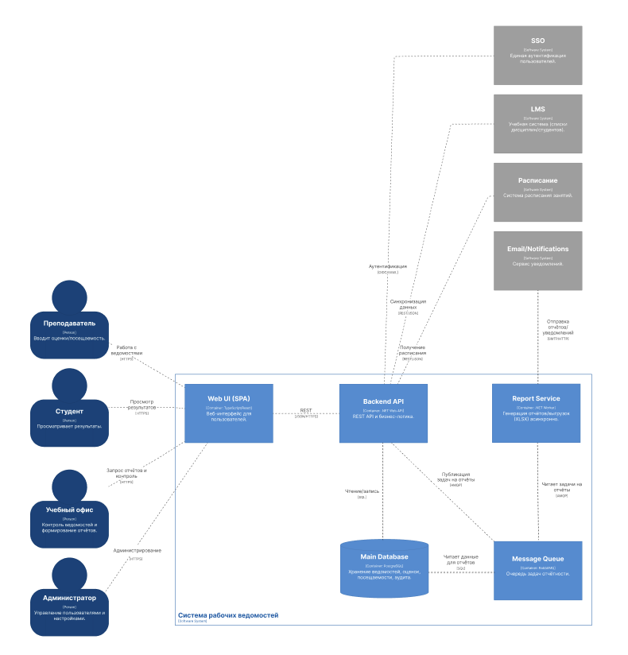
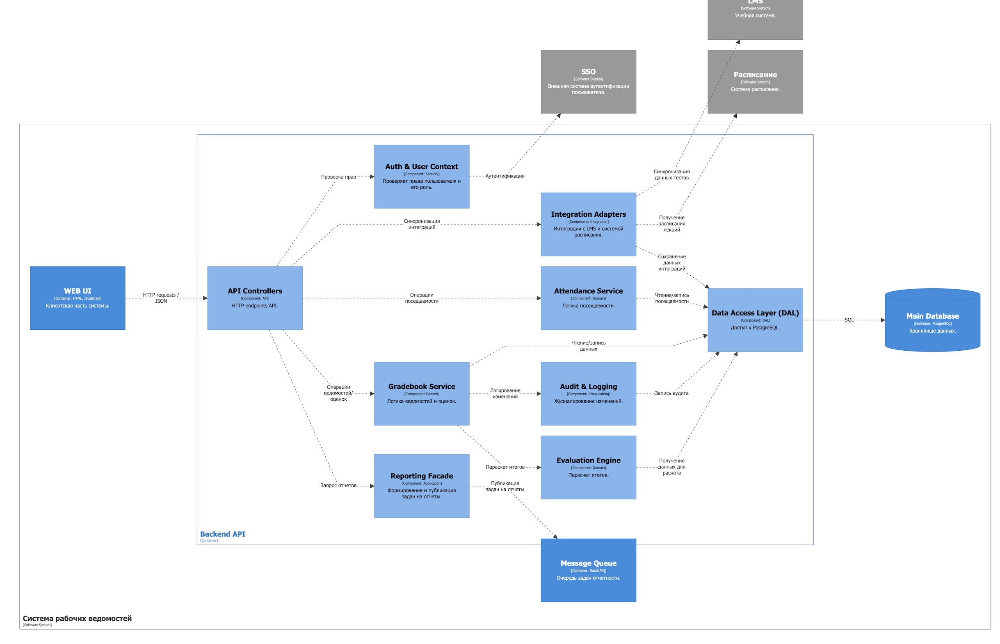
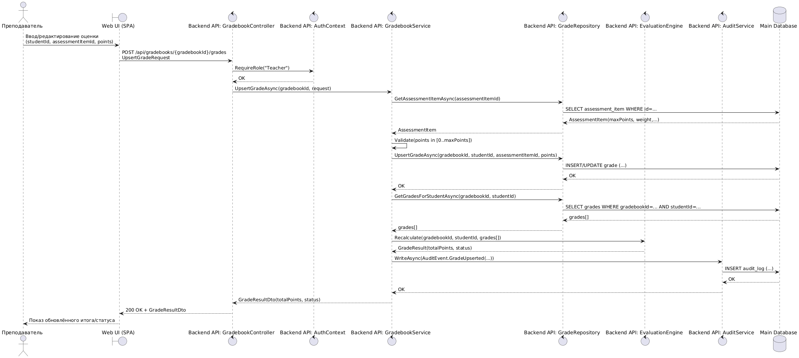
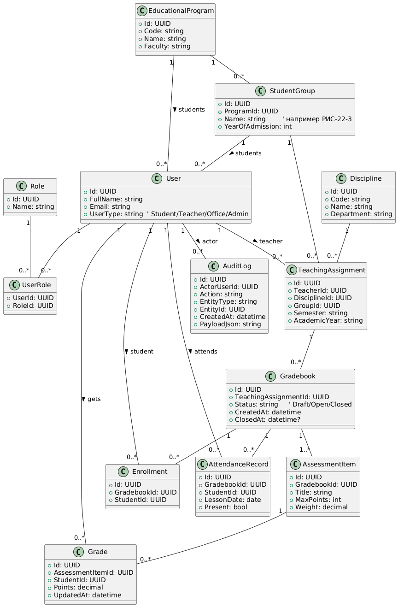

# Лабораторная работа №3
**Тема:** использование принципов проектирования на уровне методов и классов

**Цель работы:** получить опыт проектирования и реализации модулей с использованием принципов KISS, YAGNI, DRY, SOLID и др.

**Вариант использования:** преподаватель выставляет/редактирует оценку студенту по элементу контроля; система пересчитывает итог и пишет аудит

## Диаграмма контейнеров



## Диаграмма компонентов



## Диаграмма последовательностей


## Модель БД


## Применение основных принципов разработки
### KISS
KISS — решение должно быть максимально понятным и прямолинейным. 

**Серверный код:**
``` csharp
public static void ValidatePoints(decimal points, int maxPoints)
{
    if (points < 0 || points > maxPoints)
        throw new ArgumentOutOfRangeException(nameof(points), "Points out of range.");
}
```
В этом фрагменте вместо сложных правил и вложенных условий сделана одна очевидная проверка диапазона, которую легко прочитать, протестировать и переиспользовать в use case выставления оценки.

**Клиентский код:**
``` typescript
export function isPointsValid(points: number, maxPoints: number): boolean {
  return points >= 0 && points <= maxPoints;
}
```
Здесь проверка валидности баллов — это одна прозрачная функция без лишних условий и побочных эффектов, которую легко читать и использовать перед отправкой оценки на сервер.

### YAGNI
YAGNI — реализуем только то, что требуется текущему сценарию. 

**Серверный код:**
``` csharp
public sealed record UpsertGradeRequest(Guid StudentId, Guid AssessmentItemId, decimal Points);
```
Здесь контракт запроса содержит ровно три поля, необходимые для выставления/редактирования оценки; мы не добавляем заранее комментарии, причины изменения, вложения или сложные метаданные, пока бизнес реально их не потребовал.

**Клиентский код:**
``` typescript
export type UpsertGradeRequest = {
  studentId: string;
  assessmentItemId: string;
  points: number;
};
```
В этом контракте есть только поля, которые требуются для текущего сценария “выставить/редактировать оценку”; мы не добавляем заранее комментарии, вложения или сложные метаданные.

### DRY
DRY — одинаковую логику не нужно размножать по коду.

**Серверный код:**
``` csharp
public interface IGradeRepository
{
    Task UpsertGradeAsync(Guid gradebookId, Guid studentId, Guid assessmentItemId, decimal points, CancellationToken ct);
}
```
В этом фрагменте вместо двух методов CreateGrade и UpdateGrade используется один UpsertGradeAsync, который покрывает оба случая; благодаря этому не дублируется код сохранения и не возникает рассинхрон логики между “созданием” и “обновлением”.

**Клиентский код:**
``` typescript
export async function apiPost<TReq, TRes>(url: string, body: TReq): Promise<TRes> {
  const res = await fetch(url, {
    method: "POST",
    headers: { "Content-Type": "application/json" },
    credentials: "include",
    body: JSON.stringify(body),
  });

  if (!res.ok) throw new Error(`Request failed: ${res.status}`);
  return (await res.json()) as TRes;
}
```
Этот общий helper убирает дублирование fetch + headers + JSON.stringify + обработка ошибок по всем страницам, и дальше любой API-вызов делается в одну строку.

### SOLID
SOLID — набор принципов, которые делают код расширяемым и поддерживаемым. Ключевая идея — разделение ответственности и зависимости от абстракций. 

**S — Single Responsibility Principle**

Принцип единственной ответственности означает, что каждый класс должен отвечать только за одну задачу.  
В сценарии выставления оценки это удобно разделить на три отдельные обязанности:
- сохранение оценки;
- пересчет итоговой оценки;
- запись аудита изменений.

```csharp
public class GradeService
{
    private readonly IGradeRepository _gradeRepository;

    public GradeService(IGradeRepository gradeRepository)
    {
        _gradeRepository = gradeRepository;
    }

    public async Task SaveGradeAsync(Grade grade)
    {
        await _gradeRepository.SaveAsync(grade);
    }
}

public class FinalScoreCalculator
{
    public decimal Calculate(decimal currentScore, decimal examScore)
    {
        return currentScore * 0.6m + examScore * 0.4m;
    }
}

public class AuditService
{
    private readonly IAuditRepository _auditRepository;

    public AuditService(IAuditRepository auditRepository)
    {
        _auditRepository = auditRepository;
    }

    public async Task WriteRecordAsync(string userId, string action, string entityId)
    {
        await _auditRepository.SaveAsync(userId, action, entityId, DateTime.UtcNow);
    }
}
```

Здесь каждый класс выполняет только одну функцию, поэтому код проще поддерживать и изменять.

**O — Open/Closed Principle**

Принцип открытости/закрытости означает, что систему можно расширять без изменения уже работающего кода.  
Для системы ведомостей это удобно при добавлении новых правил расчета итоговой оценки.

```csharp
public interface IEvaluationStrategy
{
    decimal Calculate(IReadOnlyCollection<GradeItem> items);
}

public class WeightedEvaluationStrategy : IEvaluationStrategy
{
    public decimal Calculate(IReadOnlyCollection<GradeItem> items)
    {
        return items.Sum(x => x.Score * x.Weight);
    }
}

public class AverageEvaluationStrategy : IEvaluationStrategy
{
    public decimal Calculate(IReadOnlyCollection<GradeItem> items)
    {
        return items.Average(x => x.Score);
    }
}

public class EvaluationEngine
{
    private readonly IEvaluationStrategy _strategy;

    public EvaluationEngine(IEvaluationStrategy strategy)
    {
        _strategy = strategy;
    }

    public decimal Recalculate(IReadOnlyCollection<GradeItem> items)
    {
        return _strategy.Calculate(items);
    }
}
```

Если позже понадобится новый алгоритм расчета, можно добавить еще одну реализацию `IEvaluationStrategy`, не меняя `EvaluationEngine`.

**L — Liskov Substitution Principle**

Принцип подстановки Лисков означает, что объект производного типа должен корректно использоваться вместо базового типа.  
В проекте это удобно показать на примере репозитория оценок.

```csharp
public interface IGradeRepository
{
    Task<Grade?> GetByIdAsync(Guid id);
    Task SaveAsync(Grade grade);
}

public class PostgresGradeRepository : IGradeRepository
{
    public Task<Grade?> GetByIdAsync(Guid id)
    {
        // чтение из PostgreSQL
        throw new NotImplementedException();
    }

    public Task SaveAsync(Grade grade)
    {
        // сохранение в PostgreSQL
        throw new NotImplementedException();
    }
}

public class InMemoryGradeRepository : IGradeRepository
{
    private readonly Dictionary<Guid, Grade> _storage = new();

    public Task<Grade?> GetByIdAsync(Guid id)
    {
        _storage.TryGetValue(id, out var grade);
        return Task.FromResult(grade);
    }

    public Task SaveAsync(Grade grade)
    {
        _storage[grade.Id] = grade;
        return Task.CompletedTask;
    }
}
```

Обе реализации можно использовать вместо `IGradeRepository`: одна подходит для основной работы с БД, вторая — для тестирования или прототипирования. Клиентский код при этом менять не нужно.

**I — Interface Segregation Principle**

Принцип разделения интерфейсов означает, что клиент не должен зависеть от методов, которые ему не нужны.  
Для системы ведомостей удобнее иметь несколько узких интерфейсов вместо одного большого.

```csharp
public interface IGradeReader
{
    Task<Grade?> GetByIdAsync(Guid id);
    Task<IReadOnlyCollection<Grade>> GetByGradebookIdAsync(Guid gradebookId);
}

public interface IGradeWriter
{
    Task SaveAsync(Grade grade);
}

public interface IAuditWriter
{
    Task WriteAsync(string userId, string action, string entityId);
}
```

Тогда, например, контроллер чтения ведомости может зависеть только от `IGradeReader`, а сервис выставления оценки — только от `IGradeWriter` и `IAuditWriter`.

```csharp
public class GradebookQueryService
{
    private readonly IGradeReader _gradeReader;

    public GradebookQueryService(IGradeReader gradeReader)
    {
        _gradeReader = gradeReader;
    }
}
```

Такой подход делает зависимости точнее и уменьшает связанность компонентов.

**D — Dependency Inversion Principle**

Принцип инверсии зависимостей означает, что высокоуровневые модули должны зависеть не от конкретных реализаций, а от абстракций.  
В сценарии выставления оценки сервис должен работать не напрямую с PostgreSQL или конкретным логгером, а с интерфейсами.

```csharp
public class UpsertGradeUseCase
{
    private readonly IGradeRepository _gradeRepository;
    private readonly IEvaluationStrategy _evaluationStrategy;
    private readonly IAuditWriter _auditWriter;

    public UpsertGradeUseCase(
        IGradeRepository gradeRepository,
        IEvaluationStrategy evaluationStrategy,
        IAuditWriter auditWriter)
    {
        _gradeRepository = gradeRepository;
        _evaluationStrategy = evaluationStrategy;
        _auditWriter = auditWriter;
    }

    public async Task ExecuteAsync(Grade grade, IReadOnlyCollection<GradeItem> items, string userId)
    {
        await _gradeRepository.SaveAsync(grade);

        var finalScore = _evaluationStrategy.Calculate(items);

        await _auditWriter.WriteAsync(userId, "Grade updated", grade.Id.ToString());
    }
}
```

Здесь `UpsertGradeUseCase` не знает, какая именно база данных используется, как именно считается итоговая оценка и куда записывается аудит.  
Это упрощает замену реализаций и делает архитектуру гибче.

Применение SOLID в системе ведения рабочих ведомостей позволяет:
- разделить обязанности между компонентами;
- расширять правила расчета без переписывания существующего кода;
- заменять реализации репозиториев и сервисов без изменения клиентского кода;
- уменьшать связанность между модулями;
- строить более поддерживаемую и расширяемую серверную архитектуру.

## Дополнительные принципы разработки
### BDUF
BDUF — это подход, при котором архитектуру и детали проектирования стараются максимально полно продумать заранее, до активной разработки. 

Для системы рабочих ведомостей BDUF не подходит, потому что в проекте высока вероятность изменений: могут уточниться интеграции (SSO/LMS/расписание), формат отчётов, правила расчёта оценок, роли и права. 

### SoC
SoC — принцип разделения ответственности: каждая часть системы отвечает за свою «зону», а не за всё сразу. 

Для нашего проекта он максимально применим, потому что система естественно делится на слои и модули: UI отдельно от Backend API, бизнес-логика отдельно от доступа к данным, расчёт итогов отдельно от CRUD-операций, аудит отдельно от основного сценария, отчётность вынесена в отдельный сервис. Такое разделение снижает связанность, упрощает тестирование и позволяет развивать разные части независимо (например, менять алгоритм оценивания или способ генерации XLSX без переписывания контроллеров).

### MVP
MVP — это минимально жизнеспособная версия продукта, которая уже решает ключевую проблему пользователя и позволяет получать обратную связь. 

Для веб-версии ведомостей это очень применимо: сначала достаточно реализовать ядро — авторизацию, список дисциплин/групп, ввод оценок и посещаемости, простой расчёт итогов, просмотр студентом своих результатов и базовую выгрузку. После появления работающего MVP можно добавлять улучшения: более гибкие формулы, расширенную отчётность, роли в учебном офисе, интеграции, массовые операции, уведомления. 

### PoC
PoC — небольшой эксперимент, который доказывает, что ключевая идея или технология реально работает в заданных условиях. 

Для проекта рабочих ведомостей PoC полезен точечно там, где есть технологические или организационные риски, например интеграция с SSO (какой протокол, какие токены, как получать роли), генерация XLSX (шаблоны, производительность, требования к формату), массовый ввод оценок и нагрузка в пиковые периоды, а также модель прав доступа и аудит. В этих местах PoC позволяет быстро подтвердить выбранный стек и подход, прежде чем вкладываться в полноценную реализацию и архитектурную обвязку.
