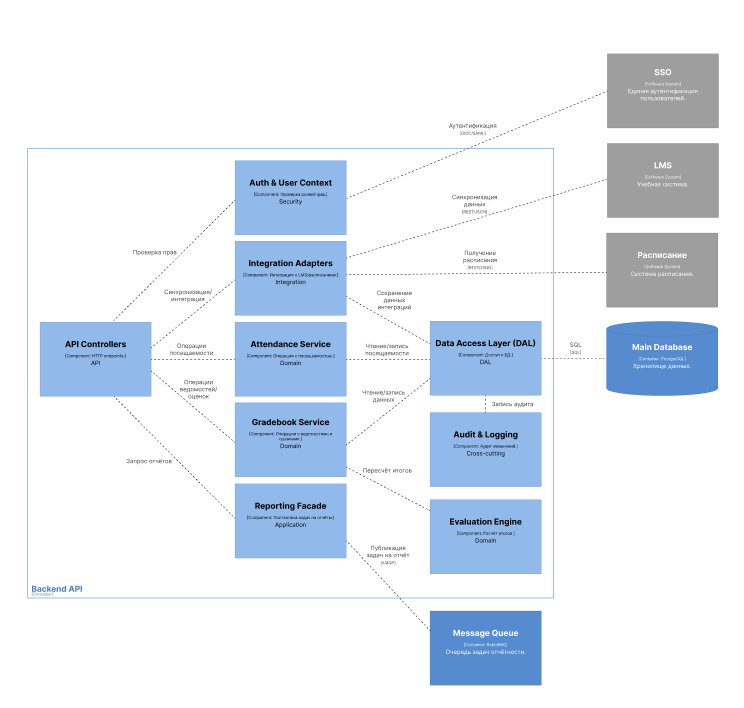

# Лабораторная работа №3
**Тема:** использование принципов проектирования на уровне методов и классов

**Цель работы:** получить опыт проектирования и реализации модулей с использованием принципов KISS, YAGNI, DRY, SOLID и др.

**Вариант использования:** преподаватель выставляет/редактирует оценку студенту по элементу контроля; система пересчитывает итог и пишет аудит

## Диаграмма контейнеров

## Диаграмма компонентов

## Диаграмма последовательностей

## Модель БД

## Применение основных принципов разработки
<Продемонстрировать фрагменты кода, пояснив какой принцип реализуется>

## Дополнительные принципы разработки
<По каждому принципу разработки из раздела повышенной сложности обосновать отказ или применение>
