# Лабораторная работа №6
**Тема:** Использование шаблонов проектирования

**Цель работы:** Получить опыт применения шаблонов проектирования при написании кода программной системы.
## Шаблоны проектирования GoF
### Порождающие шаблоны

### Factory Method (Фабричный метод)

**Общее назначение:** шаблон Factory Method определяет общий интерфейс для создания объектов, но позволяет подклассам решать, объект какого конкретного класса необходимо создавать. Это уменьшает связанность между кодом клиента и конкретными реализациями создаваемых объектов.

**Назначение в рамках проекта**: в системе рабочих ведомостей шаблон удобно применить для экспорта отчетов. Пользователь или сотрудник учебного офиса может формировать отчет в разных форматах. При этом код бизнес-логики не должен зависеть от конкретного экспортера (`xlsx`, `сsv` и т.д.). Фабричный метод позволяет вынести создание конкретного экспортера в отдельные классы.

**UML-диаграмма**
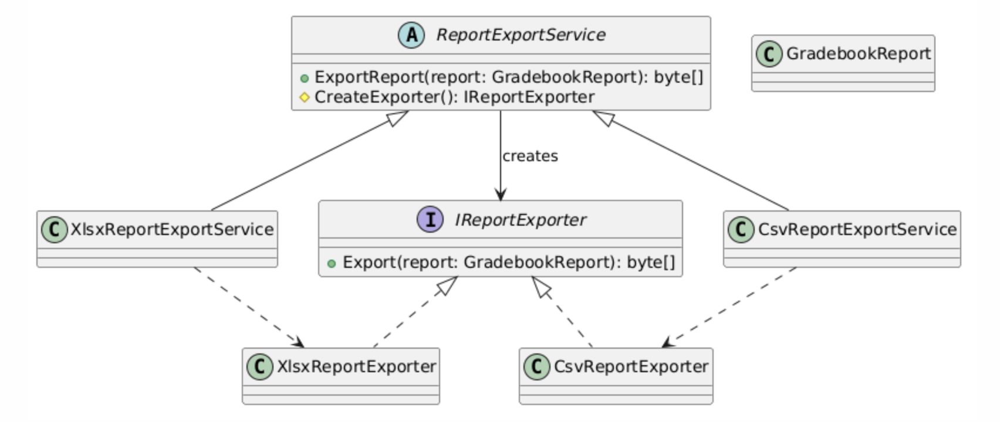

**Пример кода**
```csharp
public class GradebookReport
{
    public Guid GradebookId { get; set; }
    public string Title { get; set; } = string.Empty;
    public byte[] Content { get; set; } = Array.Empty<byte>();
}

public interface IReportExporter
{
    byte[] Export(GradebookReport report);
}

public class XlsxReportExporter : IReportExporter
{
    public byte[] Export(GradebookReport report)
    {
        return System.Text.Encoding.UTF8.GetBytes($"XLSX report: {report.Title}");
    }
}

public class CsvReportExporter : IReportExporter
{
    public byte[] Export(GradebookReport report)
    {
        return System.Text.Encoding.UTF8.GetBytes($"CSV report: {report.Title}");
    }
}

public abstract class ReportExportService
{
    public byte[] ExportReport(GradebookReport report)
    {
        var exporter = CreateExporter();
        return exporter.Export(report);
    }
    protected abstract IReportExporter CreateExporter();
}

public class XlsxReportExportService : ReportExportService
{
    protected override IReportExporter CreateExporter()
    {
        return new XlsxReportExporter();
    }
}

public class CsvReportExportService : ReportExportService
{
    protected override IReportExporter CreateExporter()
    {
        return new CsvReportExporter();
    }
}
```

**Результат применения:** использование шаблона позволяет расширять список форматов экспорта без изменения общего алгоритма формирования отчета. Для добавления нового формата достаточно создать новый класс экспортера и соответствующий сервис.

### Abstract Factory (Абстрактная фабрика)

**Общее назначение:** шаблон Abstract Factory предоставляет интерфейс для создания семейств связанных объектов без указания их конкретных классов. Он полезен, когда в системе есть несколько наборов совместимых компонентов.

**Назначение в рамках проекта:** в системе рабочих ведомостей предусмотрены интеграции с внешними системами университета: SSO, LMS и системой расписания. Для разных сред выполнения (например, реальной и тестовой) могут использоваться разные реализации этих клиентов.  
Абстрактная фабрика позволяет создавать согласованный набор интеграционных адаптеров для выбранной среды.

**UML-диаграмма**
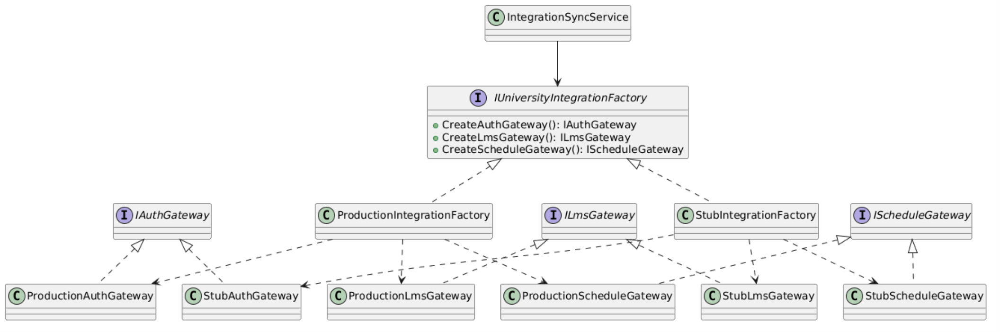

**Пример кода**
```csharp
public interface IAuthGateway
{
    Task<string> GetCurrentUserAsync(string token);
}

public interface ILmsGateway
{
    Task<IReadOnlyCollection<string>> GetCourseMaterialsAsync(Guid disciplineId);
}

public interface IScheduleGateway
{
    Task<IReadOnlyCollection<DateTime>> GetLessonDatesAsync(Guid groupId);
}

public interface IUniversityIntegrationFactory
{
    IAuthGateway CreateAuthGateway();
    ILmsGateway CreateLmsGateway();
    IScheduleGateway CreateScheduleGateway();
}

public class ProductionAuthGateway : IAuthGateway
{
    public Task<string> GetCurrentUserAsync(string token)
        => Task.FromResult("prod-user");
}

public class ProductionLmsGateway : ILmsGateway
{
    public Task<IReadOnlyCollection<string>> GetCourseMaterialsAsync(Guid disciplineId)
        => Task.FromResult<IReadOnlyCollection<string>>(new[] { "Lecture 1", "Lecture 2" });
}

public class ProductionScheduleGateway : IScheduleGateway
{
    public Task<IReadOnlyCollection<DateTime>> GetLessonDatesAsync(Guid groupId)
        => Task.FromResult<IReadOnlyCollection<DateTime>>(new[] { DateTime.Today, DateTime.Today.AddDays(7) });
}

public class StubAuthGateway : IAuthGateway
{
    public Task<string> GetCurrentUserAsync(string token)
        => Task.FromResult("stub-user");
}

public class StubLmsGateway : ILmsGateway
{
    public Task<IReadOnlyCollection<string>> GetCourseMaterialsAsync(Guid disciplineId)
        => Task.FromResult<IReadOnlyCollection<string>>(new[] { "Stub material" });
}

public class StubScheduleGateway : IScheduleGateway
{
    public Task<IReadOnlyCollection<DateTime>> GetLessonDatesAsync(Guid groupId)
        => Task.FromResult<IReadOnlyCollection<DateTime>>(new[] { DateTime.Today });
}

public class ProductionIntegrationFactory : IUniversityIntegrationFactory
{
    public IAuthGateway CreateAuthGateway() => new ProductionAuthGateway();
    public ILmsGateway CreateLmsGateway() => new ProductionLmsGateway();
    public IScheduleGateway CreateScheduleGateway() => new ProductionScheduleGateway();
}

public class StubIntegrationFactory : IUniversityIntegrationFactory
{
    public IAuthGateway CreateAuthGateway() => new StubAuthGateway();
    public ILmsGateway CreateLmsGateway() => new StubLmsGateway();
    public IScheduleGateway CreateScheduleGateway() => new StubScheduleGateway();
}

public class IntegrationSyncService
{
    private readonly IAuthGateway _authGateway;
    private readonly ILmsGateway _lmsGateway;
    private readonly IScheduleGateway _scheduleGateway;

    public IntegrationSyncService(IUniversityIntegrationFactory factory)
    {
        _authGateway = factory.CreateAuthGateway();
        _lmsGateway = factory.CreateLmsGateway();
        _scheduleGateway = factory.CreateScheduleGateway();
    }

    public async Task SyncAsync(Guid disciplineId, Guid groupId, string token)
    {
        var user = await _authGateway.GetCurrentUserAsync(token);
        var materials = await _lmsGateway.GetCourseMaterialsAsync(disciplineId);
        var dates = await _scheduleGateway.GetLessonDatesAsync(groupId);

        Console.WriteLine($"{user}: {materials.Count} materials, {dates.Count} dates");
    }
}
```

**Результат применения:** шаблон позволяет переключаться между наборами интеграций без изменения кода сервиса синхронизации. Это особенно полезно для тестирования, локальной разработки и подключения реальных внешних сервисов в продуктивной среде.

### Builder (Строитель)

**Общее назначение:** шаблон Builder позволяет создавать сложный объект поэтапно, отделяя процесс конструирования от итогового представления. Это полезно, когда объект имеет много частей и опциональных блоков.

**Назначение в рамках проекта:** в системе рабочих ведомостей можно формировать сложный отчет по дисциплине, который включает различные разделы: общие сведения, оценки, посещаемость, статистику. Не всегда нужно включать все части сразу. Шаблон Builder позволяет пошагово собирать такой объект отчета и получать разные варианты результата при одном процессе построения.

**UML-диаграмма**
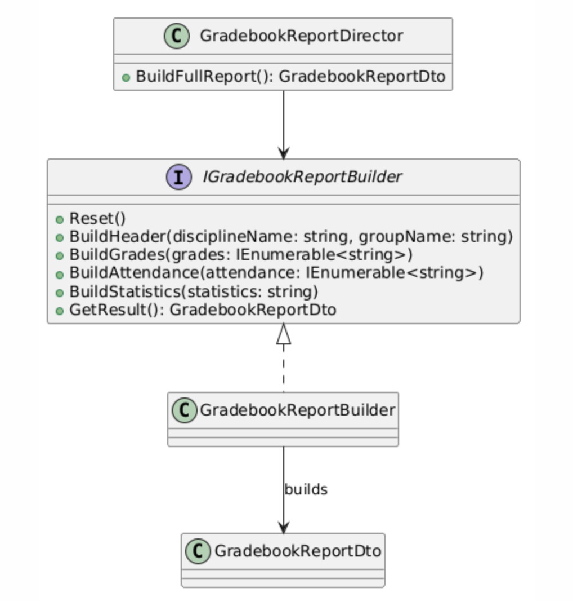

**Пример кода**
```csharp
public class GradebookReportDto
{
    public string Header { get; set; } = string.Empty;
    public List<string> Grades { get; set; } = new();
    public List<string> Attendance { get; set; } = new();
    public string Statistics { get; set; } = string.Empty;
}

public interface IGradebookReportBuilder
{
    void Reset();
    void BuildHeader(string disciplineName, string groupName);
    void BuildGrades(IEnumerable<string> grades);
    void BuildAttendance(IEnumerable<string> attendance);
    void BuildStatistics(string statistics);
    GradebookReportDto GetResult();
}

public class GradebookReportBuilder : IGradebookReportBuilder
{
    private GradebookReportDto _report = new();

    public void Reset()
    {
        _report = new GradebookReportDto();
    }

    public void BuildHeader(string disciplineName, string groupName)
    {
        _report.Header = $"Discipline: {disciplineName}; Group: {groupName}";
    }

    public void BuildGrades(IEnumerable<string> grades)
    {
        _report.Grades.AddRange(grades);
    }

    public void BuildAttendance(IEnumerable<string> attendance)
    {
        _report.Attendance.AddRange(attendance);
    }

    public void BuildStatistics(string statistics)
    {
        _report.Statistics = statistics;
    }

    public GradebookReportDto GetResult()
    {
        return _report;
    }
}

public class GradebookReportDirector
{
    private readonly IGradebookReportBuilder _builder;

    public GradebookReportDirector(IGradebookReportBuilder builder)
    {
        _builder = builder;
    }

    public GradebookReportDto BuildFullReport()
    {
        _builder.Reset();
        _builder.BuildHeader("Архитектура программных систем", "РИС-22-3");
        _builder.BuildGrades(new[] { "Иванов - 8", "Петрова - 9" });
        _builder.BuildAttendance(new[] { "Иванов - 90%", "Петрова - 100%" });
        _builder.BuildStatistics("Средний балл: 8.5");
        return _builder.GetResult();
    }
}
```

**Результат применения:** шаблон Builder делает построение сложного объекта отчета управляемым и расширяемым. Можно легко создавать разные типы отчетов: полный, краткий, только по оценкам, только по посещаемости и т.д.

### Структурные шаблоны

### Adapter (Адаптер)

**Общее назначение:** Шаблон Adapter преобразует интерфейс одного класса в другой интерфейс, ожидаемый клиентом. Он используется, когда необходимо обеспечить совместную работу классов с несовместимыми интерфейсами.

**Назначение в рамках проекта:** В системе рабочих ведомостей серверная часть интегрируется с внешними сервисами университета, например с системой расписания. Внешняя система может возвращать данные в формате, неудобном для внутреннего кода приложения.  
Адаптер позволяет преобразовать внешний интерфейс в единый внутренний интерфейс, используемый в системе.

**UML-диаграмма**
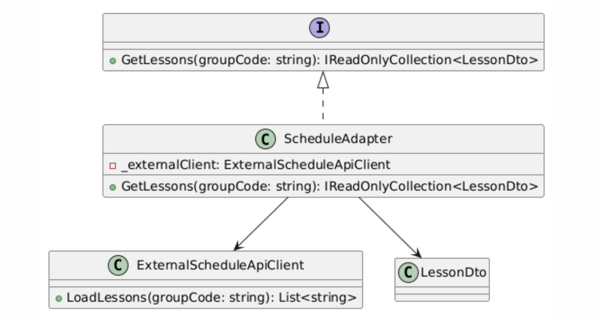

**Пример кода**

```csharp
public class ExternalScheduleApiClient
{
    public List<string> LoadLessons(string groupCode)
    {
        return new List<string>
        {
            "2026-03-01|Math",
            "2026-03-03|Architecture"
        };
    }
}

public interface IScheduleProvider
{
    IReadOnlyCollection<LessonDto> GetLessons(string groupCode);
}

public class LessonDto
{
    public DateTime Date { get; set; }
    public string Subject { get; set; } = string.Empty;
}

public class ScheduleAdapter : IScheduleProvider
{
    private readonly ExternalScheduleApiClient _externalClient;

    public ScheduleAdapter(ExternalScheduleApiClient externalClient)
    {
        _externalClient = externalClient;
    }

    public IReadOnlyCollection<LessonDto> GetLessons(string groupCode)
    {
        var rawLessons = _externalClient.LoadLessons(groupCode);

        return rawLessons
            .Select(x => x.Split('|'))
            .Select(parts => new LessonDto
            {
                Date = DateTime.Parse(parts[0]),
                Subject = parts[1]
            })
            .ToList();
    }
}
```

**Результат применения:** Использование адаптера позволяет не зависеть от формата данных внешней системы. Внутренние компоненты работают с единым интерфейсом `IScheduleProvider`, а детали интеграции изолированы в адаптере.

### Facade

**Общее назначение:** Шаблон Facade предоставляет единый упрощенный интерфейс к сложной подсистеме. Он уменьшает связанность клиента с внутренними компонентами и скрывает детали их взаимодействия.

**Назначение в рамках проекта:** В системе рабочих ведомостей формирование итогового отчета по дисциплине может включать несколько действий: загрузку ведомости, получение оценок, получение посещаемости, расчет статистики и экспорт результата. Фасад позволяет предоставить единый сервис формирования отчета, не заставляя клиента обращаться к каждому внутреннему компоненту отдельно.

**UML-диаграмма**
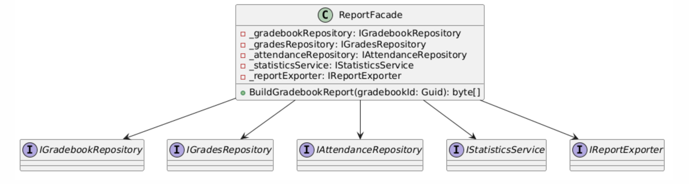

**Пример кода**
```csharp
public interface IGradebookRepository
{
    string GetGradebookTitle(Guid gradebookId);
}

public interface IGradesRepository
{
    IReadOnlyCollection<int> GetGrades(Guid gradebookId);
}

public interface IAttendanceRepository
{
    IReadOnlyCollection<int> GetAttendance(Guid gradebookId);
}

public interface IStatisticsService
{
    string BuildStatistics(IReadOnlyCollection<int> grades, IReadOnlyCollection<int> attendance);
}

public interface IReportExporter
{
    byte[] Export(string title, IReadOnlyCollection<int> grades, IReadOnlyCollection<int> attendance, string statistics);
}

public class ReportFacade
{
    private readonly IGradebookRepository _gradebookRepository;
    private readonly IGradesRepository _gradesRepository;
    private readonly IAttendanceRepository _attendanceRepository;
    private readonly IStatisticsService _statisticsService;
    private readonly IReportExporter _reportExporter;

    public ReportFacade(
        IGradebookRepository gradebookRepository,
        IGradesRepository gradesRepository,
        IAttendanceRepository attendanceRepository,
        IStatisticsService statisticsService,
        IReportExporter reportExporter)
    {
        _gradebookRepository = gradebookRepository;
        _gradesRepository = gradesRepository;
        _attendanceRepository = attendanceRepository;
        _statisticsService = statisticsService;
        _reportExporter = reportExporter;
    }

    public byte[] BuildGradebookReport(Guid gradebookId)
    {
        var title = _gradebookRepository.GetGradebookTitle(gradebookId);
        var grades = _gradesRepository.GetGrades(gradebookId);
        var attendance = _attendanceRepository.GetAttendance(gradebookId);
        var statistics = _statisticsService.BuildStatistics(grades, attendance);

        return _reportExporter.Export(title, grades, attendance, statistics);
    }
}
```

**Результат применения:** Фасад упрощает использование подсистемы отчетности. Клиент работает только с `ReportFacade`, а детали взаимодействия репозиториев, статистики и экспорта скрыты внутри.

### Decorator (Декоратор)

**Общее назначение:** Шаблон Decorator позволяет динамически добавлять объекту новые обязанности, не изменяя его исходный класс. Это гибкая альтернатива наследованию для расширения поведения.

**Назначение в рамках проекта:** В системе рабочих ведомостей при сохранении оценки может потребоваться не только запись в базу данных, но и дополнительное логирование.  Декоратор позволяет обернуть основной сервис сохранения оценки дополнительной функциональностью, например аудитом или логированием, не изменяя основной класс.

**UML-диаграмма**
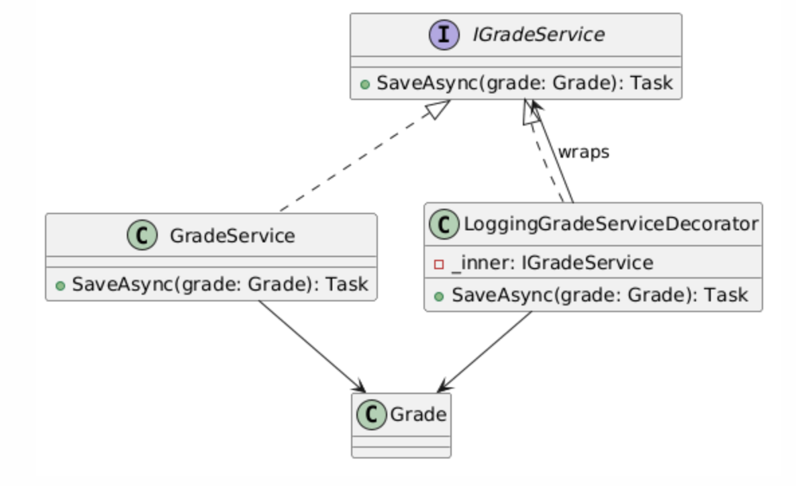

**Пример кода**
```csharp
public class Grade
{
    public Guid Id { get; set; }
    public Guid GradebookId { get; set; }
    public string StudentName { get; set; } = string.Empty;
    public int Points { get; set; }
}

public interface IGradeService
{
    Task SaveAsync(Grade grade);
}

public class GradeService : IGradeService
{
    public Task SaveAsync(Grade grade)
    {
        Console.WriteLine($"Saved grade for {grade.StudentName}");
        return Task.CompletedTask;
    }
}

public class LoggingGradeServiceDecorator : IGradeService
{
    private readonly IGradeService _inner;

    public LoggingGradeServiceDecorator(IGradeService inner)
    {
        _inner = inner;
    }

    public async Task SaveAsync(Grade grade)
    {
        Console.WriteLine($"[LOG] Saving grade {grade.Id}...");
        await _inner.SaveAsync(grade);
        Console.WriteLine($"[LOG] Grade {grade.Id} saved.");
    }
}
```

**Результат применения:** Декоратор позволяет расширять сервис без изменения базовой реализации. При необходимости можно добавлять другие декораторы: аудит, кэширование, метрики, уведомления.

### Proxy (Заместитель)**

**Общее назначение:** Шаблон Proxy предоставляет объект-заместитель, который контролирует доступ к другому объекту. Он может использоваться для ленивой загрузки, кеширования, контроля прав доступа и других задач.

**Назначение в рамках проекта:** В системе рабочих ведомостей доступ к данным конкретной ведомости должен зависеть от роли пользователя. Например, преподаватель может работать только со своими дисциплинами. Прокси позволяет добавить проверку прав доступа перед обращением к реальному сервису чтения ведомости.

**UML-диаграмма**
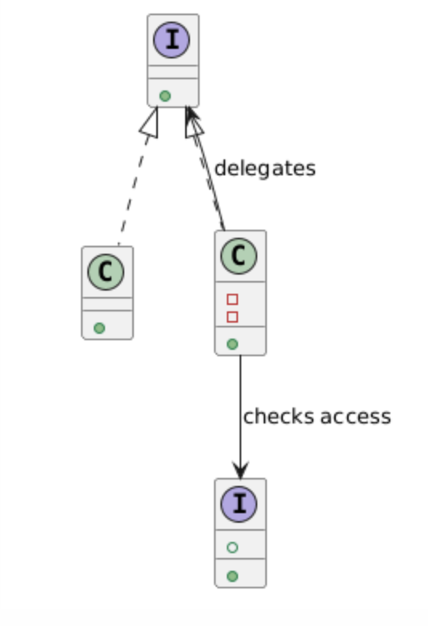

**Пример кода**
```csharp
public interface IGradebookReader
{
    string GetById(Guid gradebookId);
}

public class GradebookReader : IGradebookReader
{
    public string GetById(Guid gradebookId)
    {
        return $"Gradebook {gradebookId}";
    }
}

public interface IUserContext
{
    string Role { get; }
    bool HasAccessToGradebook(Guid gradebookId);
}

public class GradebookReaderProxy : IGradebookReader
{
    private readonly IGradebookReader _inner;
    private readonly IUserContext _userContext;

    public GradebookReaderProxy(IGradebookReader inner, IUserContext userContext)
    {
        _inner = inner;
        _userContext = userContext;
    }

    public string GetById(Guid gradebookId)
    {
        if (!_userContext.HasAccessToGradebook(gradebookId))
        {
            throw new UnauthorizedAccessException("Access denied to selected gradebook.");
        }

        return _inner.GetById(gradebookId);
    }
}
```

**Результат применения:** Прокси позволяет централизованно контролировать доступ к данным ведомостей. Основной сервис чтения остается простым, а проверка прав выносится в отдельный слой.

### Поведенческие шаблоны

### Strategy (Стратегия)

**Общее назначение:** Шаблон Strategy определяет семейство алгоритмов, инкапсулирует каждый из них и делает их взаимозаменяемыми. Это позволяет изменять алгоритм независимо от клиента, который его использует.

**Назначение в рамках проекта:** В системе рабочих ведомостей итоговая оценка может рассчитываться по разным правилам в зависимости от дисциплины. Например, для одной дисциплины используется взвешенная сумма, а для другой — простое среднее. Шаблон Strategy позволяет выделить разные алгоритмы расчета в отдельные классы и переключать их без изменения основного сервиса.

**UML-диаграмма**
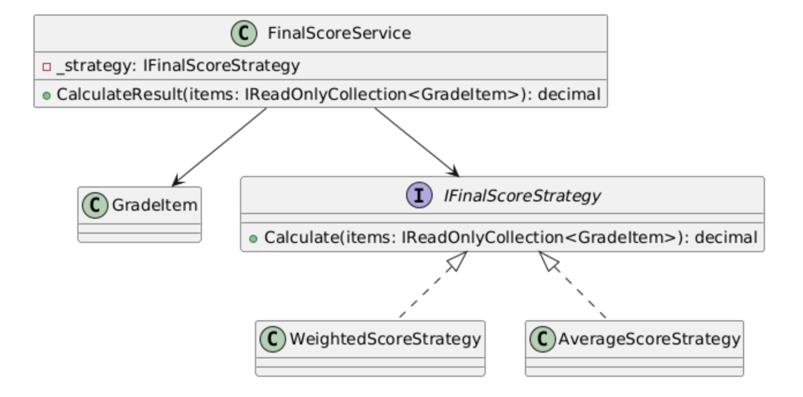

**Пример кода**
```csharp
public class GradeItem
{
    public decimal Score { get; set; }
    public decimal Weight { get; set; }
}

public interface IFinalScoreStrategy
{
    decimal Calculate(IReadOnlyCollection<GradeItem> items);
}

public class WeightedScoreStrategy : IFinalScoreStrategy
{
    public decimal Calculate(IReadOnlyCollection<GradeItem> items)
    {
        return items.Sum(x => x.Score * x.Weight);
    }
}

public class AverageScoreStrategy : IFinalScoreStrategy
{
    public decimal Calculate(IReadOnlyCollection<GradeItem> items)
    {
        return items.Count == 0 ? 0 : items.Average(x => x.Score);
    }
}

public class FinalScoreService
{
    private readonly IFinalScoreStrategy _strategy;

    public FinalScoreService(IFinalScoreStrategy strategy)
    {
        _strategy = strategy;
    }

    public decimal CalculateResult(IReadOnlyCollection<GradeItem> items)
    {
        return _strategy.Calculate(items);
    }
}
```

**Результат применения:** Шаблон позволяет добавлять новые способы расчета итоговой оценки без изменения основного сервиса.

### Command (Команда)

**Общее назначение:** Шаблон Command инкапсулирует запрос в виде объекта, что позволяет параметризовать клиентов операциями, поддерживать логирование, очереди и откат действий.

**Назначение в рамках проекта:** В системе рабочих ведомостей операция выставления оценки может быть оформлена как отдельная команда. Это удобно, так как команда может быть поставлена в очередь, записана в журнал, повторно выполнена или отменена.

**UML-диаграмма**

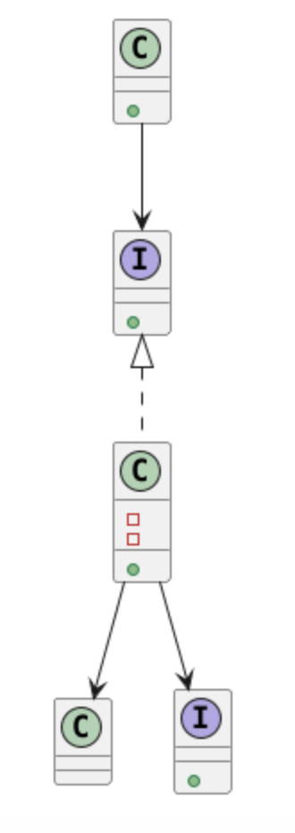

**Пример кода**
```csharp
public class Grade
{
    public Guid Id { get; set; }
    public Guid GradebookId { get; set; }
    public string StudentName { get; set; } = string.Empty;
    public int Points { get; set; }
}

public interface IGradeRepository
{
    Task SaveAsync(Grade grade);
}

public interface ICommand
{
    Task ExecuteAsync();
}

public class SaveGradeCommand : ICommand
{
    private readonly IGradeRepository _repository;
    private readonly Grade _grade;

    public SaveGradeCommand(IGradeRepository repository, Grade grade)
    {
        _repository = repository;
        _grade = grade;
    }

    public async Task ExecuteAsync()
    {
        await _repository.SaveAsync(_grade);
    }
}

public class CommandInvoker
{
    public async Task RunAsync(ICommand command)
    {
        await command.ExecuteAsync();
    }
}
```

**Результат применения:** Команда изолирует действие сохранения оценки и делает вызов более гибким.

### Observer (Наблюдатель)

**Общее назначение:** Шаблон Observer определяет зависимость «один ко многим» между объектами. Когда состояние одного объекта изменяется, все зависимые объекты автоматически уведомляются.

**Назначение в рамках проекта:** В системе рабочих ведомостей после изменения оценки может потребоваться выполнить несколько действий: записать аудит, обновить статистику, отправить уведомление. Шаблон Observer позволяет организовать это как набор подписчиков на событие изменения оценки.

**UML-диаграмма**
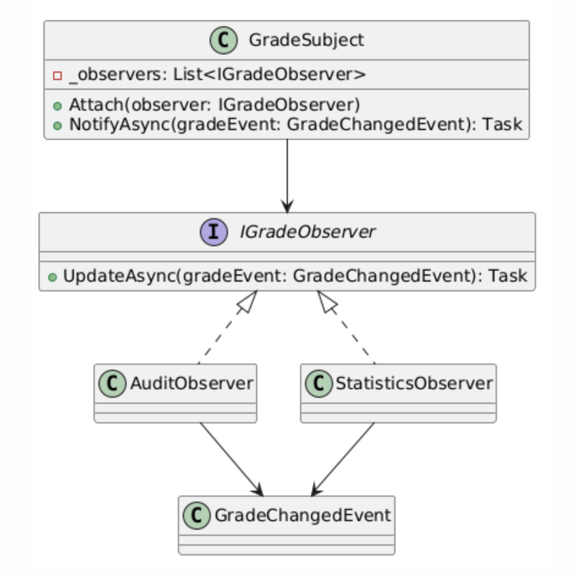

**Пример кода**
```csharp
public class GradeChangedEvent
{
    public Guid GradebookId { get; set; }
    public string StudentName { get; set; } = string.Empty;
    public int NewPoints { get; set; }
}

public interface IGradeObserver
{
    Task UpdateAsync(GradeChangedEvent gradeEvent);
}

public class AuditObserver : IGradeObserver
{
    public Task UpdateAsync(GradeChangedEvent gradeEvent)
    {
        Console.WriteLine($"Audit: {gradeEvent.StudentName} -> {gradeEvent.NewPoints}");
        return Task.CompletedTask;
    }
}

public class StatisticsObserver : IGradeObserver
{
    public Task UpdateAsync(GradeChangedEvent gradeEvent)
    {
        Console.WriteLine($"Statistics updated for gradebook {gradeEvent.GradebookId}");
        return Task.CompletedTask;
    }
}

public class GradeSubject
{
    private readonly List<IGradeObserver> _observers = new();

    public void Attach(IGradeObserver observer)
    {
        _observers.Add(observer);
    }

    public async Task NotifyAsync(GradeChangedEvent gradeEvent)
    {
        foreach (var observer in _observers)
        {
            await observer.UpdateAsync(gradeEvent);
        }
    }
}
```

**Результат применения:** Шаблон позволяет гибко добавлять новые реакции на изменение оценки без переписывания основного процесса.

### Template Method (Шаблонный метод)

**Общее назначение:** Шаблон Template Method определяет общий каркас алгоритма в базовом классе, позволяя подклассам переопределять отдельные шаги без изменения структуры алгоритма.

**Назначение в рамках проекта:** В системе рабочих ведомостей процесс формирования отчета всегда проходит по общей схеме: загрузка данных, подготовка содержимого, экспорт. Однако конкретный формат может отличаться. Шаблон Template Method позволяет задать общую последовательность шагов и переопределить только формат вывода.

**UML-диаграмма**
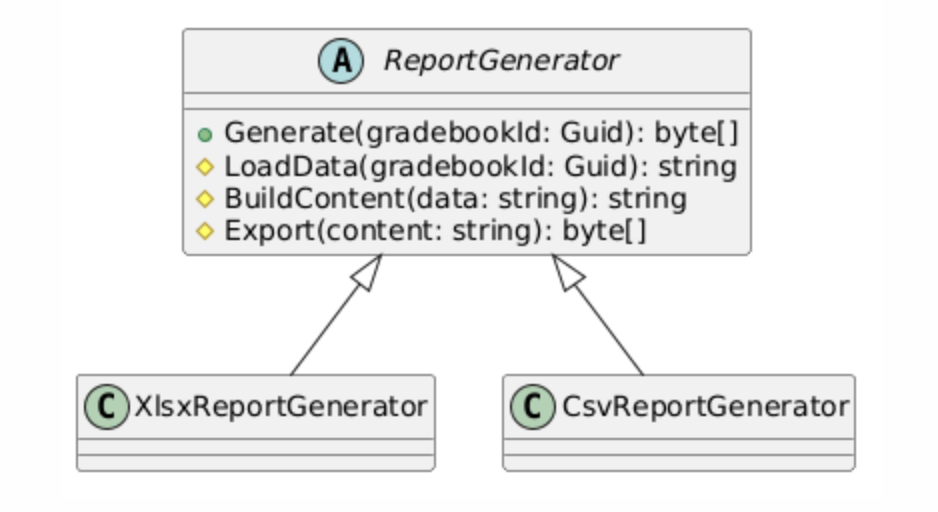

**Пример кода**
```csharp
public abstract class ReportGenerator
{
    public byte[] Generate(Guid gradebookId)
    {
        var data = LoadData(gradebookId);
        var content = BuildContent(data);
        return Export(content);
    }

    protected virtual string LoadData(Guid gradebookId)
    {
        return $"Data for gradebook {gradebookId}";
    }

    protected virtual string BuildContent(string data)
    {
        return $"Prepared content: {data}";
    }

    protected abstract byte[] Export(string content);
}

public class XlsxReportGenerator : ReportGenerator
{
    protected override byte[] Export(string content)
    {
        return System.Text.Encoding.UTF8.GetBytes($"XLSX: {content}");
    }
}

public class CsvReportGenerator : ReportGenerator
{
    protected override byte[] Export(string content)
    {
        return System.Text.Encoding.UTF8.GetBytes($"CSV: {content}");
    }
}
```

**Результат применения:** Шаблон фиксирует структуру процесса генерации отчета и позволяет менять только отдельные шаги.

### State (Состояние)

**Общее назначение:** Шаблон State позволяет объекту изменять свое поведение в зависимости от внутреннего состояния. Внешне это выглядит как изменение класса объекта.

**Назначение в рамках проекта:** В системе рабочих ведомостей ведомость может находиться, например, в состояниях: открыта, закрыта, архивирована. Доступные действия зависят от текущего состояния. Шаблон State позволяет вынести поведение для каждого состояния в отдельные классы.

**UML-диаграмма**

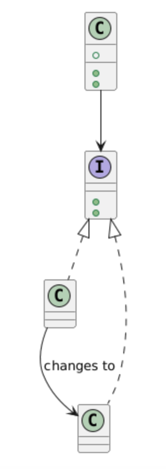

**Пример кода**
```csharp
public interface IGradebookState
{
    void AddGrade(GradebookContext context);
    void Close(GradebookContext context);
}

public class GradebookContext
{
    public IGradebookState State { get; set; }

    public GradebookContext(IGradebookState state)
    {
        State = state;
    }

    public void AddGrade()
    {
        State.AddGrade(this);
    }

    public void Close()
    {
        State.Close(this);
    }
}

public class OpenState : IGradebookState
{
    public void AddGrade(GradebookContext context)
    {
        Console.WriteLine("Grade added.");
    }

    public void Close(GradebookContext context)
    {
        Console.WriteLine("Gradebook closed.");
        context.State = new ClosedState();
    }
}

public class ClosedState : IGradebookState
{
    public void AddGrade(GradebookContext context)
    {
        throw new InvalidOperationException("Cannot add grade to closed gradebook.");
    }

    public void Close(GradebookContext context)
    {
        Console.WriteLine("Gradebook is already closed.");
    }
}
```

**Результат применения:** Шаблон позволяет явно описать правила работы с ведомостью в зависимости от ее текущего статуса.
